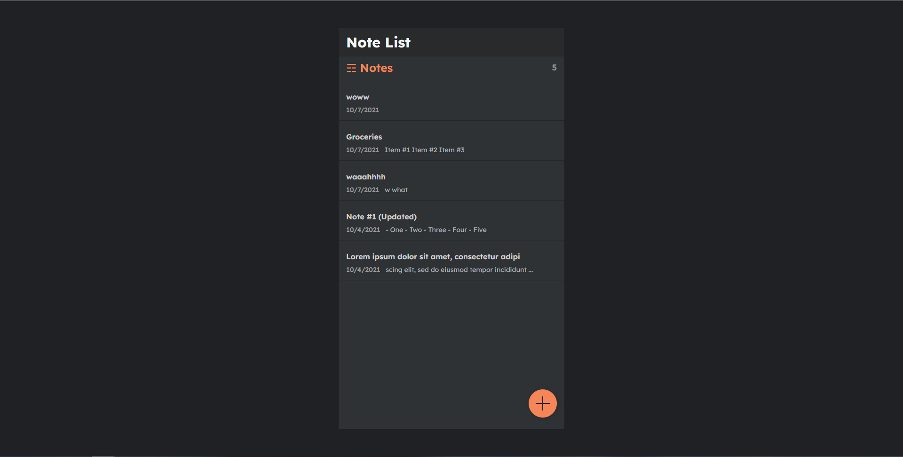
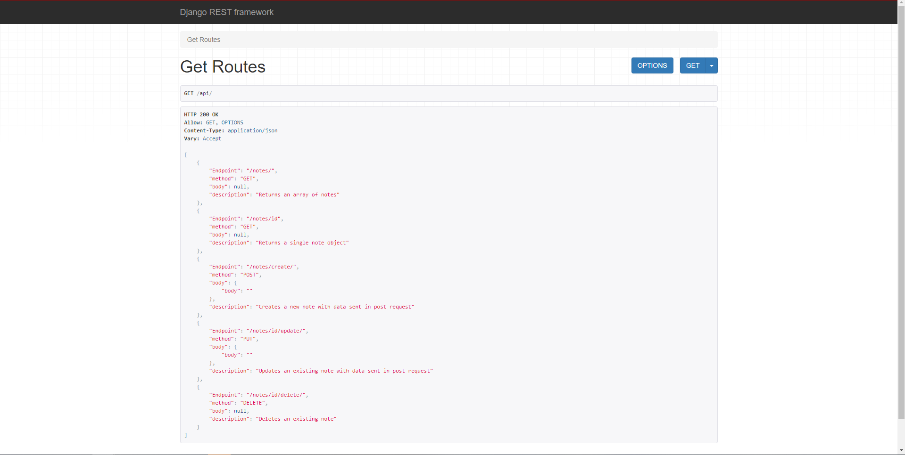

# Notes App

## **Motivation**
I wanted to recreate the "notes" app on the iphone as practice for my Django and React skills. It wasn't my intention to fully recreate the app, but to practice REST principles (create, delete, edit, notes based on a request from the client). 

 

## **Description**
My recreation of the 'notes' app on the iphone created using React and Django. Users have the ability to add new notes, edit existing notes, and delete notes. 

 

## **Technologies Used**
- React
- Django
- Django REST framework

 

## **What I learned**
This was my first major project using React and Django together and using the **Django Rest Framework** (DRF) saved me a lot of time. The advantage of DRF is that it allows us to easily start up a simple model-backed API and from there we can utilize the other benefits of DRF such as serializers and the 'Request/Response' Objects. DRF also provides an "@api view" which is a decorator that makes our API view look much nicer.

 
 

## Running the app

you can run the app locally by doing python manage.py runserver